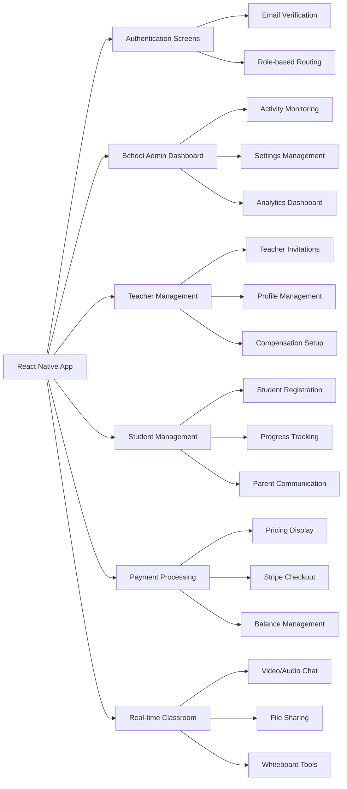
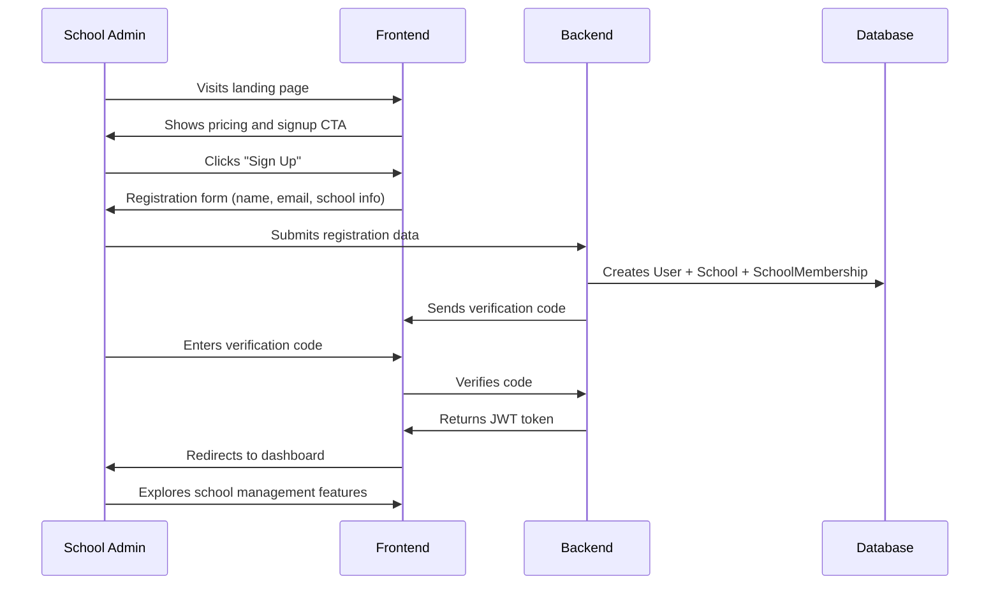
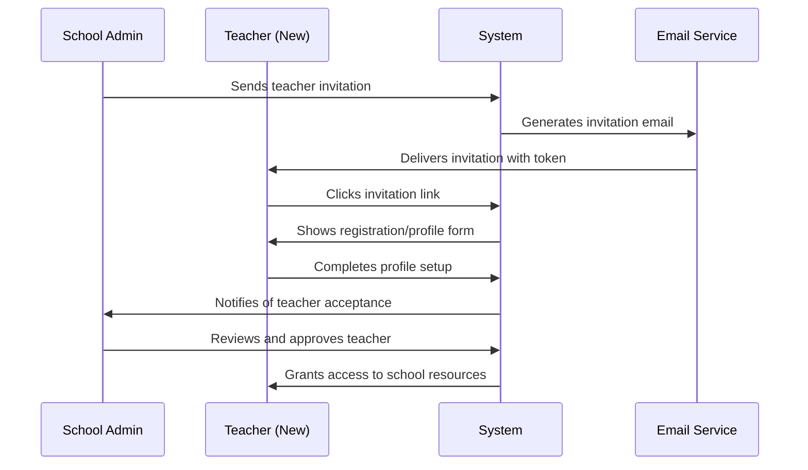
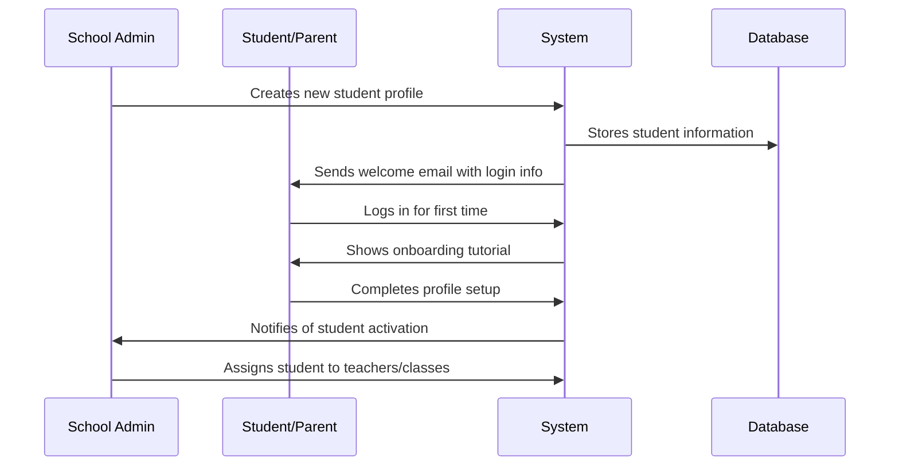
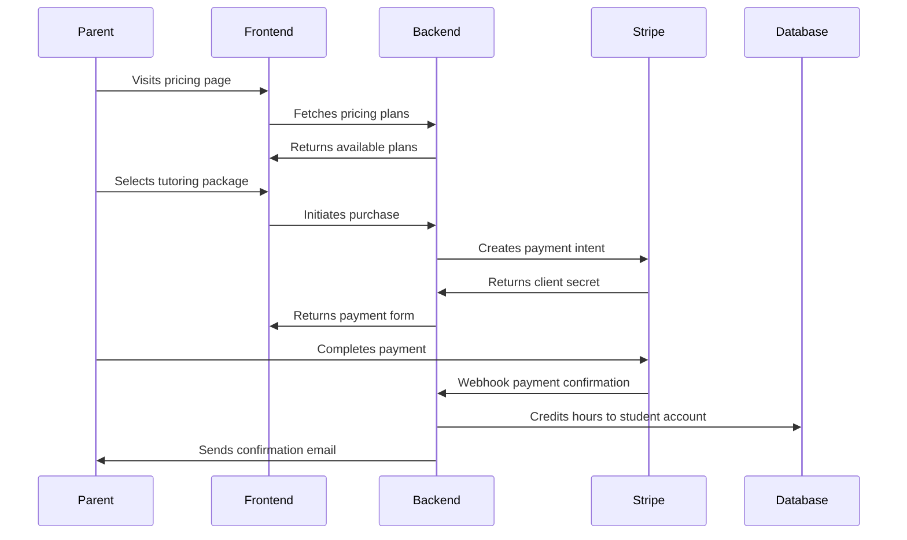
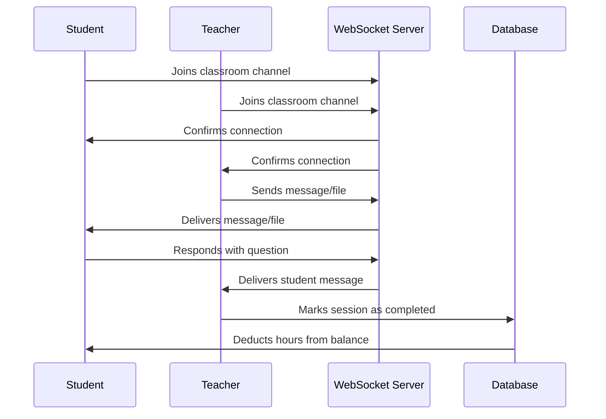

# Aprende Comigo - Comprehensive Product Report
## Educational Platform Analysis: Target Audience & User Flow Analysis

**Report Date:** July 31, 2025  
**Report Version:** 1.0  
**Analysis Scope:** Complete platform architecture, user roles, and business flows  
**Report Author:** Senior Product Strategist  

---

## Executive Summary

Aprende Comigo is a sophisticated educational technology platform that facilitates real-time tutoring connections between schools, teachers, and students. Built on a robust Django REST Framework backend with React Native cross-platform frontend, the platform manages complex multi-role user relationships, financial transactions, and real-time classroom interactions.

### Key Platform Capabilities
- **Multi-School Management**: School administrators can manage multiple educational institutions
- **Teacher Compensation System**: Complex payment calculations with grade-specific rates and trial policies
- **Real-Time Tutoring**: WebSocket-powered live classroom interactions with chat and file sharing
- **Financial Management**: Stripe integration for student/parent payments and teacher compensation
- **Task Management**: Comprehensive productivity system with onboarding workflows

### Critical Findings
- ✅ **Backend Excellence**: Robust, scalable architecture with comprehensive business logic
- ⚠️ **Frontend Gaps**: Missing key management interfaces and incomplete user flows
- 🔴 **Payment Disconnect**: Frontend-backend integration gaps preventing revenue generation
- 🟢 **Strong Foundation**: Well-designed permissions system and database architecture

---

## Target Audience Analysis

### Primary User Segments

#### 1. Educational Institutions (School Administrators)
**Profile:**
- **Role**: School Owners & Administrators
- **Organization Size**: Small to medium educational institutions (50-500 students)
- **Geography**: Portuguese-speaking markets (Portugal, Brazil) with expansion potential
- **Pain Points**: 
  - Managing teacher recruitment and compensation
  - Coordinating student tutoring schedules
  - Tracking educational progress and payments
  - Scaling tutoring operations efficiently

**Value Proposition:**
- Centralized school management dashboard
- Automated teacher invitation and onboarding
- Student enrollment and progress tracking
- Financial oversight and billing management

**Key Features Used:**
- Teacher profile management and bulk invitations
- Student management with educational system integration
- School settings and operational configuration
- Activity monitoring and reporting dashboards

#### 2. Professional Educators (Teachers)
**Profile:**
- **Role**: Individual tutors and institutional teachers
- **Experience Level**: Certified educators with subject specializations
- **Working Model**: Part-time tutoring, full-time teaching, or hybrid arrangements
- **Income Goals**: Supplemental income (€500-2000/month) or primary income

**Pain Points:**
- Finding consistent tutoring opportunities
- Managing multiple school relationships
- Complex compensation calculations
- Scheduling coordination across institutions

**Value Proposition:**
- Access to multiple school networks
- Transparent, automated compensation system
- Flexible scheduling and availability management
- Professional profile and portfolio development

**Key Features Used:**
- Multi-school membership management
- Compensation rule configuration (grade-specific rates)
- Availability scheduling and calendar integration
- Real-time classroom teaching tools

#### 3. Students & Families (End Users)
**Profile:**
- **Primary Users**: Students aged 6-18 across educational levels
- **Decision Makers**: Parents for younger students, independent for secondary
- **Economic Status**: Middle to upper-middle class families investing in supplemental education
- **Educational Systems**: Portuguese (1º-12º ano), Brazilian (EF/EM), Custom/International

**Pain Points:**
- Finding qualified tutors for specific subjects
- Scheduling flexibility around school hours
- Transparent pricing and hour tracking
- Progress monitoring and parental oversight

**Value Proposition:**
- Access to vetted, qualified tutors
- Flexible scheduling with real-time interaction
- Transparent hour-based pricing system
- Progress tracking and academic support

**Key Features Used:**
- Tutor discovery and booking system
- Real-time classroom participation
- Hour balance management and tracking
- Parent/guardian oversight and communication

#### 4. Parents & Guardians (Financial Decision Makers)
**Profile:**
- **Role**: Financial decision makers for student tutoring
- **Involvement Level**: High oversight for elementary, moderate for secondary
- **Budget Range**: €50-300/month per child for tutoring services
- **Decision Factors**: Teacher quality, scheduling flexibility, progress visibility

**Pain Points:**
- Evaluating tutor quality and effectiveness
- Managing multiple children's tutoring schedules  
- Budget planning and expense tracking
- Ensuring educational value and progress

**Value Proposition:**
- Vetted teacher network with profiles and ratings
- Flexible payment options (packages vs. subscriptions)
- Progress monitoring and communication tools
- Volume discounts for multiple children

**Key Features Used:**
- Payment processing and plan management
- Child progress monitoring dashboards
- Communication with teachers and schools
- Financial tracking and billing oversight

### Secondary User Segments

#### 5. Individual Tutors (Business Model B)
**Profile:**
- Independent educators operating as single-person "schools"
- Entrepreneurial teachers building private tutoring businesses
- Subject matter experts offering specialized instruction

**Platform Usage:**
- Creates personal "school" entity for business management
- Manages own student base and scheduling
- Handles direct payments and compensation

---

## Technical Architecture Overview

### Backend System (Django REST Framework)

```mermaid
graph TB
    A[Django REST API] --> B[Authentication System]
    A --> C[School Management]
    A --> D[Financial System]
    A --> E[Real-time Classroom]
    A --> F[Task Management]
    
    B --> B1[Passwordless Email Auth]
    B --> B2[JWT Token Management]
    B --> B3[Multi-Role Permissions]
    
    C --> C1[School CRUD Operations]
    C --> C2[Teacher Invitations]
    C --> C3[Student Enrollment]
    C --> C4[Membership Management]
    
    D --> D1[Stripe Integration]
    D --> D2[Pricing Plans]
    D --> D3[Teacher Compensation]
    D --> D4[Hour Tracking]
    
    E --> E1[WebSocket Consumers]
    E --> E2[Real-time Messaging]
    E --> E3[File Sharing]
    E --> E4[Session Management]
    
    F --> F1[Task CRUD]
    F --> F2[Onboarding Workflows]
    F --> F3[Automated Task Creation]
```



### Frontend System (React Native + Expo)



---

## Core User Flows & User Stories

### Flow 1: School Administrator Onboarding



**User Stories:**

**Epic: School Administrator Registration & Setup**

**Story 1.1: Account Creation**
- **As a** school administrator
- **I want to** create an account with my school information
- **So that** I can manage my institution's tutoring operations
- **Acceptance Criteria:**
  - Can enter school name, contact info, and administrator details
  - Account creation is atomic (user + school created together)
  - Receives email verification code within 2 minutes
  - Can verify account with 6-digit code

**Story 1.2: School Profile Setup**
- **As a** school administrator  
- **I want to** configure my school's operational settings
- **So that** the platform matches our institutional needs
- **Acceptance Criteria:**
  - Can set educational system (Portuguese, Brazilian, Custom)
  - Can configure grade levels offered
  - Can set working hours, timezone, and availability
  - Can upload school logo and set brand colors

**Story 1.3: Dashboard Access**
- **As a** school administrator
- **I want to** access a comprehensive management dashboard
- **So that** I can oversee all tutoring operations
- **Acceptance Criteria:**
  - Dashboard shows recent activity and key metrics
  - Quick access to teacher and student management
  - Financial overview with pending payments
  - Real-time notification system

### Flow 2: Teacher Invitation & Onboarding



**User Stories:**

**Epic: Teacher Recruitment & Management**

**Story 2.1: Teacher Invitation**
- **As a** school administrator
- **I want to** invite qualified teachers to join my school
- **So that** I can build a strong tutoring team
- **Acceptance Criteria:**
  - Can send individual or bulk teacher invitations
  - Can include custom message in invitation
  - Can set specific role and compensation rules
  - Can track invitation status and responses

**Story 2.2: Teacher Profile Creation**
- **As a** teacher receiving an invitation
- **I want to** create a comprehensive professional profile
- **So that** schools and students can assess my qualifications
- **Acceptance Criteria:**
  - Can enter educational background and certifications
  - Can specify teaching subjects and grade levels
  - Can set availability schedule and hourly rates
  - Can upload photo and professional documents

**Story 2.3: Multi-School Management**
- **As a** teacher
- **I want to** work with multiple schools simultaneously
- **So that** I can maximize my income opportunities
- **Acceptance Criteria:**
  - Can accept invitations from multiple schools
  - Can set different rates for different schools
  - Can manage separate schedules per school
  - Can switch between school contexts easily

### Flow 3: Student Enrollment & Management



**User Stories:**

**Epic: Student Enrollment & Academic Management**

**Story 3.1: Student Registration**
- **As a** school administrator
- **I want to** enroll students in the tutoring system
- **So that** they can access our educational services
- **Acceptance Criteria:**
  - Can enter student demographic and academic information
  - Can assign to appropriate educational system and grade level
  - Can set parent/guardian contact information
  - Can configure academic goals and special needs

**Story 3.2: Student-Teacher Matching**
- **As a** school administrator
- **I want to** match students with appropriate teachers
- **So that** learning outcomes are optimized
- **Acceptance Criteria:**
  - Can view teacher profiles and specializations
  - Can assign students based on subject needs
  - Can set individual or group tutoring preferences
  - Can track teacher-student relationship effectiveness

**Story 3.3: Progress Monitoring**
- **As a** school administrator
- **I want to** monitor student academic progress
- **So that** I can ensure quality educational outcomes
- **Acceptance Criteria:**
  - Can view session attendance and participation
  - Can track academic improvement metrics
  - Can generate progress reports for parents
  - Can identify students needing additional support

### Flow 4: Parent Payment & Hour Management



**User Stories:**

**Epic: Payment Processing & Hour Management**

**Story 4.1: Pricing Discovery**
- **As a** parent
- **I want to** understand tutoring pricing options
- **So that** I can make informed purchasing decisions
- **Acceptance Criteria:**
  - Can view all available pricing plans
  - Can see cost per hour calculations
  - Can compare package vs. subscription options
  - Can understand validity periods and restrictions

**Story 4.2: Payment Processing**
- **As a** parent
- **I want to** securely purchase tutoring hours
- **So that** my child can access educational services
- **Acceptance Criteria:**
  - Can complete payment using credit/debit cards
  - Payment processing is secure (PCI compliant)
  - Receives immediate confirmation of purchase
  - Hours are credited to student account automatically

**Story 4.3: Hour Balance Management**
- **As a** parent
- **I want to** monitor my child's tutoring hour usage
- **So that** I can plan future purchases and track value
- **Acceptance Criteria:**
  - Can view current hour balance in real-time
  - Can see detailed usage history
  - Can track hours by teacher and subject
  - Receives notifications before hours expire

### Flow 5: Real-Time Tutoring Session



**User Stories:**

**Epic: Real-Time Tutoring Experience**

**Story 5.1: Session Initiation**
- **As a** student
- **I want to** join scheduled tutoring sessions easily
- **So that** I can receive educational support
- **Acceptance Criteria:**
  - Can join sessions with one-click access
  - Can see teacher availability status
  - Can participate in audio/video communication
  - Can share screen for homework assistance

**Story 5.2: Interactive Learning Tools**
- **As a** teacher
- **I want to** use interactive tools during tutoring sessions
- **So that** I can provide effective instruction
- **Acceptance Criteria:**
  - Can share files and documents
  - Can use virtual whiteboard for explanations
  - Can send/receive messages in real-time
  - Can record sessions for later review

**Story 5.3: Session Management**
- **As a** teacher
- **I want to** manage session flow and duration
- **So that** tutoring time is used effectively
- **Acceptance Criteria:**
  - Can start/end sessions with proper hour tracking
  - Can extend sessions if needed (with hour deduction)
  - Can mark sessions as completed
  - Can add session notes and student feedback

---

## Business Logic Analysis

### Teacher Compensation System

The platform implements a sophisticated compensation system supporting multiple payment models:

**Compensation Rule Types:**
1. **Grade-Specific Rates**: Different hourly rates based on educational level
2. **Group Class Multipliers**: Adjusted rates for multiple students
3. **Fixed Monthly Salaries**: Guaranteed minimum compensation
4. **Hybrid Models**: Base salary plus performance bonuses

**Trial Class Policies:**
- **School Absorbs**: School pays teacher full rate, absorbs trial cost
- **Teacher Absorbs**: Teacher provides trial for free
- **Split Cost**: 50/50 cost sharing between school and teacher

**Example Compensation Calculation:**
```python
# Grade 10 Math session, 1 hour, individual student
base_rate = 20.00  # €20/hour for Grade 10
session_duration = 1.0  # hours
student_count = 1

if session.is_trial and school.trial_policy == 'teacher_absorbs':
    teacher_payment = 0.00
elif session.is_group_class:
    # Group multiplier (e.g., 1.5x for 2-3 students)
    teacher_payment = base_rate * session_duration * 1.5
else:
    teacher_payment = base_rate * session_duration  # €20.00
```

### Hour Tracking & Consumption

**Student Account Balance Model:**
- Tracks purchased hours vs. consumed hours
- Supports multiple transaction sources
- Handles expiration dates for package-based purchases
- Maintains audit trail for all hour movements

**Hour Consumption Process:**
1. Student joins tutoring session
2. Session duration tracked in real-time
3. On session completion, hours automatically deducted
4. Teacher compensation calculated and recorded
5. Both student and teacher notified of transaction

**Package Expiration Management:**
- Background tasks monitor package validity
- Automated notifications before expiration
- Grace period for unused hours
- Refund processing for unused amounts

### Educational System Integration

The platform supports multiple educational systems with proper grade-level validation:

**Portuguese System (Default):**
- 1º ano through 12º ano
- Ensino Básico (1º-3º Ciclo) and Ensino Secundário
- Subject-specific curriculum alignment

**Brazilian System:**
- Ensino Fundamental (Anos Iniciais/Finais)
- Ensino Médio structure
- Regional curriculum variations

**Custom/International:**
- Flexible grade level definitions
- Adaptable to any educational system
- Custom subject classifications

---

## Critical Gaps & Recommendations

### High Priority Issues

#### 1. Frontend-Backend Integration Gaps (Critical)
**Impact:** Revenue blocking, user experience breakdown
**Issues:**
- Payment processing frontend shows hardcoded pricing
- Purchase buttons only log to console, no Stripe integration
- Missing student dashboard with hour balance visibility
- No teacher management interface for school administrators

**Recommendations:**
- Implement dynamic pricing API integration
- Complete Stripe checkout flow implementation
- Build comprehensive dashboard interfaces
- Add real-time balance updates

#### 2. Incomplete User Onboarding (High)
**Impact:** User confusion, high abandonment rates
**Issues:**
- No clear post-registration navigation
- Missing role-specific onboarding tutorials
- Incomplete teacher invitation acceptance flow
- No parent/guardian account setup process

**Recommendations:**
- Design guided onboarding sequences for each user type
- Implement progress indicators and completion tracking
- Add interactive dashboard tours
- Create role-specific welcome experiences

#### 3. Missing Core Management Features (High)
**Impact:** Platform unusability for primary use cases
**Issues:**
- No teacher profile management interface
- Missing student enrollment and management tools
- No scheduling/calendar integration
- Limited real-time classroom interface

**Recommendations:**
- Prioritize teacher and student management UI development
- Integrate calendar systems for scheduling
- Complete real-time tutoring interface
- Add bulk import capabilities for efficiency

### Medium Priority Enhancements

#### 4. Communication & Notification Systems
**Impact:** User engagement and platform stickiness
**Missing Features:**
- Parent-teacher communication channels
- Automated session reminders
- Progress update notifications
- System-wide announcement capabilities

#### 5. Analytics & Reporting
**Impact:** Business intelligence and optimization
**Missing Features:**
- School performance dashboards
- Teacher effectiveness metrics
- Student progress analytics
- Financial reporting and forecasting

#### 6. Mobile Optimization
**Impact:** User accessibility and convenience
**Missing Features:**
- Mobile-responsive management interfaces
- Push notification system
- Offline capability for essential features
- Touch-optimized tutoring tools

---

## Success Metrics & KPIs

### Primary Business Metrics

**User Acquisition:**
- School administrator signup conversion rate
- Teacher invitation acceptance rate
- Student enrollment completion rate
- Parent payment conversion rate

**User Engagement:**
- Average sessions per student per month
- Teacher utilization rates (hours taught/available)
- Session completion rates
- User retention (30/60/90 day)

**Financial Performance:**
- Monthly recurring revenue (MRR)
- Average revenue per user (ARPU)
- Teacher payout efficiency
- Platform transaction volume

### Operational Metrics

**Platform Performance:**
- Page load times (<2 seconds)
- API response times (<500ms)
- WebSocket connection stability (>99%)
- Payment processing success rate (>98%)

**User Experience:**
- Onboarding completion rates by user type
- Support ticket volume and resolution time
- Feature adoption rates
- User satisfaction scores (NPS)

**Quality Assurance:**
- Automated test coverage (>80%)
- Bug report rates and resolution times
- Security incident frequency
- Data accuracy and consistency

---

## Technology Stack Assessment

### Backend Strengths
- **Django REST Framework**: Mature, scalable API architecture
- **PostgreSQL**: Robust relational database with complex relationship support
- **Django Channels**: Real-time WebSocket support for tutoring sessions
- **Stripe Integration**: Secure, PCI-compliant payment processing
- **Comprehensive Testing**: 50+ QA test cases covering critical flows

### Frontend Opportunities  
- **React Native + Expo**: Cross-platform development efficiency
- **TypeScript**: Type safety and developer experience
- **Gluestack UI**: Consistent design system
- **NativeWind**: Utility-first styling approach

### Infrastructure Considerations
- **Scalability**: Current architecture supports moderate growth
- **Security**: Proper authentication and permission systems in place
- **Monitoring**: Logging and error tracking capabilities
- **Deployment**: Support for multiple environments (dev, staging, production)

---

## Market Positioning & Competitive Analysis

### Unique Value Propositions

**For Schools:**
- Multi-school management capability
- Sophisticated teacher compensation system
- Real-time tutoring session monitoring
- Comprehensive financial oversight tools

**For Teachers:**
- Transparent, automated payment processing
- Multi-institutional opportunity access
- Professional profile and portfolio development
- Flexible scheduling and availability management

**For Students/Parents:**
- Hour-based pricing model with transparent tracking
- Real-time tutoring with professional educators
- Progress monitoring and academic support
- Multiple payment options (packages vs. subscriptions)

### Competitive Differentiation

**Technical Superiority:**
- Real-time WebSocket-based tutoring sessions
- Complex multi-role permission system
- Sophisticated financial transaction processing
- Cross-platform mobile and web accessibility

**Business Model Innovation:**
- Dual B2B (schools) and B2C (parents) revenue streams
- Teacher compensation automation
- Multi-educational system support
- Scalable institution management

---

## Implementation Roadmap

### Phase 1: Foundation Completion (Weeks 1-4)
**Priority: Critical**
- Complete frontend-backend payment integration
- Implement core dashboard interfaces
- Fix user onboarding flows
- Deploy essential management tools

### Phase 2: Feature Enhancement (Weeks 5-8)
**Priority: High**
- Add communication and notification systems
- Implement scheduling and calendar integration
- Enhance real-time tutoring capabilities
- Deploy analytics and reporting tools

### Phase 3: Scale & Optimize (Weeks 9-12)
**Priority: Medium**
- Mobile optimization and push notifications
- Advanced analytics and business intelligence
- Performance optimization and monitoring
- User experience refinements

### Phase 4: Market Expansion (Months 4-6)
**Priority: Strategic**
- Multi-language support
- Additional educational system integration
- Advanced feature development
- Market expansion capabilities

---

## Conclusion

Aprende Comigo represents a well-architected educational technology platform with significant potential for transforming the tutoring industry. The robust backend infrastructure demonstrates thoughtful design for complex educational workflows, while the comprehensive business logic supports sophisticated operational requirements.

**Key Strengths:**
- Sophisticated multi-role user management system
- Complex financial transaction processing
- Real-time communication capabilities
- Comprehensive educational system integration
- Scalable technical architecture

**Critical Success Factors:**
- Immediate completion of frontend-backend integration gaps
- User experience optimization for all stakeholder types
- Market-ready payment processing implementation
- Comprehensive onboarding and tutorial systems

**Business Potential:**
With proper execution of the identified improvements, Aprende Comigo can establish itself as a leading platform in the educational technology space, serving both institutional and individual market segments while providing measurable value to all stakeholders.

The platform's technical foundation positions it well for rapid scaling once core user experience gaps are addressed, making it a compelling opportunity in the growing EdTech market.

**Recommended Next Steps:**
1. Prioritize frontend-backend integration completion
2. Implement comprehensive user onboarding systems  
3. Deploy essential management interfaces for all user types
4. Establish monitoring and analytics infrastructure
5. Begin market validation with pilot school partnerships

---

*This report provides a comprehensive analysis of the Aprende Comigo educational platform based on thorough codebase examination, user flow analysis, and business logic assessment. All recommendations are based on actual system capabilities and identified improvement opportunities.*