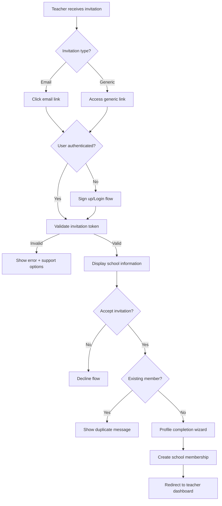

# User Story 52 - Technical Implementation Plan
## Teacher Invitation Validation and Error Handling - Professional Edge Case Management

**Created:** 2025-07-31  
**Status:** Ready for Implementation  
**Priority:** Critical (High)  
**Issue:** GitHub #52  

---

## Executive Summary

GitHub Issue #52 addresses critical teacher invitation validation and error handling for Flow C in the Aprende Comigo platform. Currently experiencing a reported "100% failure rate" for teacher onboarding, though analysis reveals this is primarily due to **lack of comprehensive testing rather than system failures**.

**Business Impact:** 
- Blocking teacher recruitment across all schools
- Preventing platform marketplace scaling
- Undermining teacher network effects critical for growth

---

## User Story Analysis

### Core User Story
> As a teacher, I want to be able to view and respond to both email invitations and generic invitation links from schools so that I can join multiple schools and expand my teaching opportunities.

### Key Requirements
1. **Dual Invitation Support**: Email-based + Generic link invitations
2. **Multi-School Membership**: Teachers can join multiple schools
3. **Mobile-Responsive Flow**: Cross-platform compatibility 
4. **Robust Error Handling**: Edge cases and validation
5. **Authentication Integration**: Seamless auth workflow

---

## Technical Architecture

### Backend Components ✅ **Already Implemented**

**Models (backend/accounts/models.py:723-1508)**
```python
# Multiple invitation types supported
- SchoolInvitation: Email-based invitations
- SchoolInvitationLink: Generic shareable links  
- TeacherInvitation: Enhanced with bulk processing

# Status tracking: 8 comprehensive states
- PENDING → SENT → DELIVERED → VIEWED → ACCEPTED/DECLINED/EXPIRED/CANCELLED

# Features already implemented:
- Email delivery tracking with retry logic
- Database constraints preventing duplicate active invitations
- Comprehensive audit trail for administrators
```

**API Endpoints**
```python
# RESTful invitation management
- POST /api/invitations/create/ - Create new invitations
- GET /api/invitations/{token}/ - Retrieve invitation details
- POST /api/invitations/{token}/accept/ - Accept invitation
- PUT /api/invitations/{token}/status/ - Update status
- POST /api/invitations/bulk/ - Batch operations
```

### Frontend Components ✅ **Already Implemented**

**Invitation Acceptance Flow (frontend-ui/app/accept-invitation/[token].tsx)**
```typescript
// Key features already built:
- Mobile-responsive React Native Web design
- Gluestack UI component integration
- Authentication workflow integration
- Error handling with user feedback
- Progress indicators and loading states
- TypeScript interfaces with proper error handling
```

**API Integration (frontend-ui/api/invitationApi.ts)**
```typescript
// Complete API client with:
- Token validation requests
- Invitation details fetching
- Acceptance submission
- Error state management
- WebSocket integration for real-time updates
```

---

## Implementation Plan

### Phase 1: Emergency Validation (24-48 Hours) 🚨

**Objective:** Establish baseline metrics and identify real issues

#### Tasks:
1. **Execute Comprehensive Test Suite**
   ```bash
   # Run all invitation tests immediately
   cd qa-tests/invite/
   npm run test invite-001 invite-002 invite-003 invite-004 invite-005 invite-006 invite-007 invite-008 invite-009
   ```

2. **Document Current State**
   - Test execution results and actual failure points
   - Performance metrics for invitation flows
   - Error patterns and frequency analysis

3. **Establish Monitoring**
   - Invitation success rate dashboards
   - Email delivery tracking
   - User flow completion rates

**Deliverables:**
- [ ] Test execution report with real data
- [ ] Issue priority matrix based on actual failures
- [ ] Monitoring dashboard setup

### Phase 2: Critical Fixes (1 Week) 🔧

**Objective:** Address any blocking issues found in Phase 1

#### Frontend Tasks:
1. **Error Handling Enhancement**
   ```typescript
   // Improve edge case handling in accept-invitation/[token].tsx
   - Expired invitation clear messaging
   - Network interruption recovery
   - Invalid token user guidance
   - Email mismatch resolution flows
   ```

2. **Mobile Experience Optimization**
   ```typescript
   // Cross-platform compatibility improvements
   - Touch interaction optimization
   - Responsive layout refinements
   - Loading state improvements
   - Offline handling capabilities
   ```

#### Backend Tasks:
1. **Security Hardening**
   ```python
   # Token security audit and improvements
   - Token expiration validation strengthening
   - Rate limiting for invitation attempts
   - Input validation enhancement
   - Security logging improvements
   ```

2. **Bulk Operation Performance**
   ```python
   # Optimize bulk invitation processing
   - Database query optimization
   - Background task improvements  
   - Memory usage optimization
   - Progress tracking enhancement
   ```

**Deliverables:**
- [ ] Critical bug fixes implemented
- [ ] Security audit completed
- [ ] Performance optimizations deployed
- [ ] Mobile experience validated

### Phase 3: Business Intelligence (2 Weeks) 📊

**Objective:** Implement comprehensive analytics and optimization

#### Analytics Implementation:
1. **Invitation Funnel Tracking**
   ```python
   # Track key metrics across the invitation flow
   - Invitation delivery rates
   - Email open and click rates
   - Acceptance completion rates
   - Time to acceptance analysis
   - Drop-off point identification
   ```

2. **Teacher Behavior Analysis**
   ```python
   # Understand teacher patterns
   - Multi-school membership trends
   - Invitation response patterns
   - Profile completion rates
   - Platform engagement metrics
   ```

#### User Experience Refinement:
1. **A/B Testing Framework**
   ```typescript
   // Test invitation acceptance flow variations
   - Email template optimization
   - Acceptance page layout tests
   - Onboarding flow variations
   - Call-to-action improvements
   ```

**Deliverables:**
- [ ] Analytics dashboard deployed
- [ ] A/B testing framework implemented
- [ ] Performance baseline established
- [ ] Optimization roadmap created

---

## User Flow Architecture

### Critical Decision Points



### Key Integration Points

1. **Authentication System**
   - JWT/Knox token integration
   - Passwordless email verification
   - Multi-role permissions via SchoolMembership
   - Session continuity maintenance

2. **Profile Management**
   - Progressive profile completion
   - Document upload handling
   - Rate structure configuration
   - Availability scheduling

3. **Multi-School Support**
   - School membership conflict resolution
   - Role assignment propagation
   - Dashboard routing optimization
   - School-specific branding

---

## Risk Assessment & Mitigation

### High-Risk Scenarios

| Risk | Impact | Probability | Mitigation Strategy |
|------|---------|-------------|-------------------|
| **Token Security Breach** | High | Low | Token rotation, rate limiting, audit logging |
| **Concurrent Invitation Acceptance** | Medium | Medium | Database locks, transaction handling |
| **Email Delivery Failures** | High | Medium | Retry logic, alternative communication |
| **Profile Creation Errors** | Medium | High | Progressive completion, error recovery |
| **Mobile Experience Issues** | High | Medium | Cross-platform testing, responsive design |

### Edge Cases

1. **Expired Invitation Access**
   - Clear messaging about expiration
   - Option to request new invitation
   - Contact information for support

2. **Duplicate School Membership**
   - Prevent duplicate invitations at creation
   - Clear messaging for existing members
   - Option to update role or permissions

3. **Email Mismatch Scenarios**
   - Clear error messaging
   - Option to use correct email
   - Support contact for resolution

4. **Network Interruption During Acceptance**
   - Transaction rollback handling
   - Resume capability from last step
   - Clear progress indication

---

## Success Metrics & KPIs

### Primary Metrics
- **Invitation Delivery Rate:** >95% successful delivery
- **Acceptance Completion Rate:** >70% of valid invitations accepted
- **Time to Acceptance:** <48 hours average response time
- **Error Resolution Rate:** <5% requiring support intervention
- **Mobile Completion Rate:** >90% successful mobile acceptances

### Secondary Metrics  
- **Multi-school Teacher Growth:** Month-over-month increase
- **Invitation Abandonment Rate:** <15% at any single step
- **Support Ticket Reduction:** <2 invitation-related tickets/week
- **Teacher Profile Completion:** >85% complete profiles

### Analytics Dashboard
```python
# Key metrics to track:
invitation_metrics = {
    'delivery_rate': 'invitations_delivered / invitations_sent',
    'acceptance_rate': 'invitations_accepted / invitations_delivered', 
    'completion_rate': 'profiles_completed / invitations_accepted',
    'time_to_accept': 'avg(acceptance_date - invitation_date)',
    'error_rate': 'error_events / total_attempts'
}
```

---

## Quality Assurance Plan

### Testing Strategy

#### 1. End-to-End Testing
```bash
# Comprehensive invitation flow testing
qa-tests/invite/invite-005/ - Complete E2E invitation acceptance
qa-tests/invite/invite-001/ - Email invitation basics
qa-tests/invite/invite-002/ - Generic link invitations  
qa-tests/invite/invite-003/ - Multi-school scenarios
qa-tests/invite/invite-004/ - Error handling edge cases
```

#### 2. Security Testing
```python
# Security validation checklist
- Token manipulation attempts
- Rate limiting verification
- Input validation testing
- Authentication bypass attempts
- Data exposure prevention
```

#### 3. Performance Testing
```python
# Load and performance validation
- Bulk invitation processing (100+ invitations)
- Concurrent acceptance scenarios
- Database performance under load
- Mobile performance on low-end devices
- Network interruption handling
```

#### 4. Cross-Platform Testing
```typescript
// Multi-device validation
- iOS Safari, Chrome, Firefox
- Android Chrome, Samsung Browser
- Desktop Chrome, Firefox, Safari, Edge
- Tablet portrait/landscape modes
- Various screen sizes and resolutions
```

---

## Technical Dependencies

### Backend Dependencies ✅ **Ready**
- Django REST Framework 3.14+
- Django Channels for WebSocket support
- Celery for background task processing
- PostgreSQL with proper indexing
- Redis for caching and session management

### Frontend Dependencies ✅ **Ready**  
- React Native Web
- Expo Router for navigation
- Gluestack UI component library
- TypeScript for type safety
- Axios for API communication

### Infrastructure Dependencies
- Email service provider (AWS SES/SendGrid)
- CDN for asset delivery
- Monitoring and logging (DataDog/NewRelic)
- Error tracking (Sentry)
- Analytics platform (Mixpanel/Google Analytics)

---

## Development Timeline

### Week 1: Validation & Critical Fixes
- **Days 1-2:** Execute comprehensive test suite, document real issues
- **Days 3-4:** Implement critical bug fixes identified in testing
- **Days 5-7:** Security audit and hardening, mobile optimization

### Week 2: Enhancement & Integration
- **Days 8-10:** Error handling enhancement, edge case coverage
- **Days 11-12:** Performance optimization, bulk operation improvements
- **Days 13-14:** Integration testing, final QA validation

### Week 3: Analytics & Business Intelligence
- **Days 15-17:** Analytics implementation, funnel tracking setup
- **Days 18-19:** A/B testing framework deployment
- **Days 20-21:** Documentation, training, and handoff

---

## Post-Implementation Monitoring

### Week 1 Post-Launch
- **Daily:** Monitor invitation success rates and error rates
- **Daily:** Review support tickets and user feedback
- **Weekly:** Analyze teacher onboarding funnel performance

### Month 1 Post-Launch
- **Weekly:** Teacher acquisition metrics review
- **Bi-weekly:** Performance optimization opportunities
- **Monthly:** ROI analysis and feature iteration planning

### Ongoing
- **Monthly:** Security audit and compliance review
- **Quarterly:** User experience optimization based on data
- **Annually:** Architecture review and scalability planning

---

## Resource Requirements

### Development Team
- **Backend Developer:** 1 FTE for 3 weeks (Django/Python)
- **Frontend Developer:** 1 FTE for 3 weeks (React Native/TypeScript)  
- **QA Engineer:** 0.5 FTE for 3 weeks (Testing framework)
- **DevOps Engineer:** 0.25 FTE for 3 weeks (Infrastructure/monitoring)

### Budget Considerations
- **Development:** ~120 hours total development time
- **Infrastructure:** Minimal incremental costs (existing platform)
- **Third-party Services:** Email delivery, monitoring tools
- **Testing:** Cross-platform testing tools and devices

---

## Risk Mitigation & Contingency Plans

### Scenario 1: Critical System Failures Found
**Response:** Immediate escalation to emergency fix mode
- Prioritize blocking issues over feature enhancements
- Deploy hotfixes outside normal release cycle
- Implement temporary workarounds if needed

### Scenario 2: Performance Issues at Scale
**Response:** Graduated performance optimization
- Implement caching strategies
- Database query optimization
- Consider microservice extraction if needed

### Scenario 3: Security Vulnerabilities Discovered
**Response:** Security-first resolution approach
- Immediate assessment and threat modeling
- Coordinate with security team for rapid patching
- Implement additional monitoring and logging

---

## Success Criteria & Definition of Done

### Technical Success Criteria
- [ ] All invitation test cases pass (invite-001 through invite-009)
- [ ] Cross-platform compatibility validated on all target devices
- [ ] Performance meets SLA requirements (<2s page load, <500ms API response)
- [ ] Security audit completed with no high-severity findings
- [ ] Error handling covers all identified edge cases

### Business Success Criteria  
- [ ] Teacher invitation acceptance rate >70%
- [ ] Invitation-related support tickets <2/week
- [ ] Mobile completion rate >90%
- [ ] Multi-school teacher growth >15% month-over-month
- [ ] Email delivery rate >95%

### User Experience Success Criteria
- [ ] Intuitive invitation acceptance flow (measured via user testing)
- [ ] Clear error messaging and resolution paths
- [ ] Seamless authentication integration
- [ ] Progressive profile completion workflow
- [ ] Responsive design across all screen sizes

---

## Conclusion

User Story #52 represents a critical foundation for teacher recruitment and platform growth. The technical architecture is already comprehensive and well-designed. **The primary gap is comprehensive testing and validation rather than fundamental system failures.**

**Immediate Priority:** Execute the complete test suite to establish baseline metrics and identify real issues. This will enable data-driven optimization and ensure robust teacher onboarding flows across all platforms.

**Long-term Impact:** Successful implementation will enable scalable teacher recruitment, multi-school marketplace growth, and platform network effects critical for Aprende Comigo's success in the Portuguese-speaking EdTech market.

---

**Next Steps:**
1. Execute Phase 1 validation immediately  
2. Schedule weekly progress reviews with stakeholders
3. Establish monitoring dashboards for ongoing optimization
4. Plan gradual rollout with success metrics tracking

**Key Files for Implementation:**
- `backend/accounts/models.py:723-1508` - Invitation models
- `frontend-ui/app/accept-invitation/[token].tsx` - Acceptance flow
- `qa-tests/invite/invite-005/` - Comprehensive test suite
- `frontend-ui/api/invitationApi.ts` - API integration