# Teacher Onboarding Flows Documentation

This document outlines all the different ways users can become teachers in the Aprende Comigo platform, with detailed flow diagrams and explanations.

## Overview

The platform supports **4 distinct teacher onboarding scenarios**, all requiring user consent and verification:

1. **Self-Onboarding**: Current user becomes a teacher themselves
2. **Invite New User**: School admin creates a new user account and invites them as teacher
3. **Invite Existing User**: School admin creates invitation for existing user to accept later
4. **Generic Invitation Link**: School admin creates shareable link for anyone to join as teacher

> **Design Principle**: All teacher onboarding requires explicit user acceptance to ensure consent and proper user experience. No teachers are added without their knowledge or approval.

## Teacher Onboarding Flow Diagram

The diagram below shows all possible paths for teacher onboarding:

```mermaid
flowchart TD
    Start([User wants to become teacher]) --> Decision{Who initiates?}

    Decision -->|User themselves| SelfOnboard[POST /api/accounts/teachers/onboarding/]
    SelfOnboard --> SelfResult[✅ Teacher profile created<br/>+ Auto teacher memberships for admins]

    Decision -->|School Admin| AdminDecision{User exists?}

    AdminDecision -->|Yes, invite to accept| InviteExisting[POST /api/accounts/teachers/invite-existing/]
    InviteExisting --> InviteCreated[📧 Invitation created with token]
    InviteCreated --> UserReceives[👤 User receives invitation link]
    UserReceives --> UserAccepts["POST /api/accounts/invitations/token/accept/"]
    UserAccepts --> AcceptResult[✅ Teacher profile + membership created]

    AdminDecision -->|No, create new user| InviteNew[POST /api/accounts/teachers/invite-new/]
    InviteNew --> NewUserResult[✅ User + Teacher profile + membership created<br/>📧 Welcome email sent]

    Decision -->|Via shared link| LinkFlow[User clicks invitation link]
    LinkFlow --> LinkDetails["GET /api/accounts/invitation-links/token/"]
    LinkDetails --> AuthCheck{User authenticated?}
    AuthCheck -->|No| Login[👤 User logs in/registers]
    AuthCheck -->|Yes| JoinSchool[POST /api/accounts/schools/join-via-link/]
    Login --> JoinSchool
    JoinSchool --> JoinResult[✅ Teacher profile + membership created]

    AdminDecision -->|Create shareable link| CreateLink["GET /api/accounts/schools/id/invitation-link/"]
    CreateLink --> LinkCreated[🔗 Reusable invitation link created]
    LinkCreated --> ShareLink[Admin shares link via WhatsApp/Email/SMS]
    ShareLink --> LinkFlow

    classDef userAction fill:#e1f5fe
    classDef adminAction fill:#f3e5f5
    classDef apiCall fill:#e8f5e8
    classDef result fill:#fff3e0
    classDef decision fill:#fce4ec

    class Start,UserReceives,Login userAction
    class InviteExisting,InviteNew,ShareLink,CreateLink adminAction
    class SelfOnboard,InviteExisting,InviteNew,UserAccepts,LinkDetails,JoinSchool apiCall
    class SelfResult,InviteCreated,AcceptResult,NewUserResult,JoinResult,LinkCreated result
    class Decision,AdminDecision,AuthCheck decision
```

## Detailed Flow Descriptions

### 1. Self-Onboarding Flow 🙋‍♂️

**When to use**: User decides to become a teacher themselves

**API Endpoint**: `POST /api/accounts/teachers/onboarding/`

**Flow**:
1. User calls the onboarding endpoint with optional bio, specialty, and course IDs
2. System creates a `TeacherProfile` for the user
3. **Enhanced Feature**: If user is a school owner/admin, system automatically creates teacher memberships for all their managed schools
4. System associates selected courses with the teacher profile

**Key Benefits**:
- User-initiated, ensuring full consent
- Automatic teacher membership creation for school owners/admins
- No duplicate profiles (prevents "already has teacher profile" errors)
- Immediate course association

**Test Coverage**: ✅ 39 tests passing

---

### 2. Invite New User Flow 📧

**When to use**: School admin wants to create a new user account and invite them

**API Endpoint**: `POST /api/accounts/teachers/invite-new/`

**Permissions**: `IsSchoolOwnerOrAdmin`

**Flow**:
1. Admin provides email, name, and optional phone for new user
2. System creates new `CustomUser` account
3. System creates `TeacherProfile` and `SchoolMembership`
4. System sends welcome email with account credentials
5. New user can log in and review their teacher profile

**Key Benefits**:
- Complete onboarding for users who don't have accounts yet
- User receives notification and can review their profile
- Atomic transaction ensures consistency

**Use Case**: Onboarding teachers who need new accounts

---

### 3. Invite Existing User Flow 📨

**When to use**: School admin wants to invite an existing user to accept a teacher role

**API Endpoints**:
- `POST /api/accounts/teachers/invite-existing/` (create invitation)
- `POST /api/accounts/invitations/{token}/accept/` (accept invitation)
- `GET /api/accounts/invitations/{token}/details/` (view invitation)

**Permissions**:
- Create: `IsSchoolOwnerOrAdmin`
- Accept: `IsAuthenticated`
- Details: Public (no auth required)

**Flow**:
1. Admin creates invitation with user email and school ID
2. System creates `SchoolInvitation` with secure token (7-day expiration)
3. System optionally sends email/SMS notifications
4. User receives invitation link and can view details
5. **User explicitly accepts** invitation with optional profile customization
6. System creates `TeacherProfile` and `SchoolMembership`

**Key Features**:
- **Explicit user consent** required
- Token-based security with expiration
- Duplicate prevention (no multiple pending invitations)
- Optional profile customization during acceptance
- Public invitation preview (no auth needed)

**Use Case**: Formal invitation process where user needs time to consider and explicitly accept

**Test Status**: ❌ Tests failing due to permission configuration issues (implementation complete)

---

### 4. Generic Invitation Link Flow 🔗

**When to use**: School admin wants a shareable link for multiple people to join

**API Endpoints**:
- `GET /api/accounts/schools/{school_id}/invitation-link/` (get/create link)
- `GET /api/accounts/invitation-links/{token}/` (view link details)
- `POST /api/accounts/schools/join-via-link/` (join via link)

**Permissions**:
- Create: `IsSchoolOwnerOrAdmin`
- View: Public
- Join: `IsAuthenticated`

**Flow**:
1. Admin requests invitation link for their school
2. System creates or returns existing `SchoolInvitationLink` (1-year expiration)
3. Admin shares link via WhatsApp, email, SMS, or any method
4. Users click link and view school details (public access)
5. Users log in/register if needed
6. **Users explicitly choose to join** with optional profile customization
7. System creates `TeacherProfile` and `SchoolMembership`

**Key Features**:
- **User-driven acceptance** process
- Long-lived links (1 year expiration)
- Unlimited usage (unless max_uses is set)
- Usage tracking and analytics
- Universal sharing (any communication method)
- One link per school per role

**Use Case**: Bulk invitations, social media sharing, QR codes, mass communication

---

## API Security & Permissions

### Permission Classes Used

1. **`IsAuthenticated`**: Basic requirement for self-onboarding and joining
2. **`IsSchoolOwnerOrAdmin`**: Required for creating invitations
3. **Public Access**: For viewing invitation details and encouraging sign-ups

### Security Features

- **Token-based invitations**: 64-character secure tokens
- **Expiration handling**: 7 days for personal invitations, 1 year for generic links
- **Atomic transactions**: Prevent partial failures
- **Duplicate prevention**: No multiple pending invitations
- **Permission validation**: Strict checks for admin operations
- **Usage tracking**: Monitor invitation link usage

---

## User Consent & Experience

### Design Principles

1. **Explicit Consent**: All teacher roles require user acceptance
2. **Transparency**: Users see school details before accepting
3. **Control**: Users can customize their profiles during acceptance
4. **Notification**: Users are properly informed about invitations
5. **Reversibility**: Clear processes for declining or leaving

### User Experience Flow

1. **Invitation Received**: User gets clear communication about invitation
2. **Preview**: User can view school and role details without committing
3. **Authentication**: Secure login/registration process
4. **Acceptance**: Explicit action required to become teacher
5. **Customization**: Optional profile setup during acceptance
6. **Confirmation**: Clear feedback that they're now a teacher

---

## Error Handling

### Common Error Scenarios

1. **403 Forbidden**: User lacks admin permissions
2. **400 Bad Request**: Duplicate teacher profiles, invalid emails, expired tokens
3. **404 Not Found**: Invalid schools, users, or tokens
4. **500 Server Error**: Database issues, email service failures

### Graceful Degradation

- **Email failures**: Invitation created but notification failed
- **Partial data**: Core entities created even if optional data fails
- **Rollback protection**: Atomic transactions prevent inconsistent states

---

## Testing Status

| Flow | Status | Test Count | Notes |
|------|--------|------------|-------|
| Self-Onboarding | ✅ Passing | 39 total | Enhanced with auto-memberships |
| Invite New User | ✅ Passing | Included in total | Working correctly |
| Invite Existing User | ❌ Failing | 15 new tests | Permission config issues |
| Generic Invitation Link | 📝 Planned | Not implemented | Next phase |

---

## Deprecated Patterns

### ❌ Removed: "Add Existing User" Flow

**Why removed**: This pattern violated user consent by creating teacher profiles without explicit user acceptance.

**Replacement**: Use "Invite Existing User" flow instead, which requires explicit user acceptance.

**Migration**: Any existing `/add-existing/` endpoints should be deprecated and replaced with invitation-based flows.

---

## Integration Points

### Frontend Integration

1. **Admin Dashboard**: Manage invitation creation and tracking
2. **Teacher Dashboard**: Self-onboarding and invitation acceptance
3. **Public Pages**: Invitation link previews and join flows
4. **Email Templates**: Clear invitation and welcome emails
5. **Notification System**: SMS and email sending

### Database Schema

- **`TeacherProfile`**: Core teacher information
- **`SchoolMembership`**: User-school-role relationships
- **`SchoolInvitation`**: Personal invitations with tokens
- **`SchoolInvitationLink`**: Generic shareable links
- **`TeacherCourse`**: Teacher-course associations

---

## Next Steps

1. **Remove/Deprecate**: Remove or deprecate `/add-existing/` endpoint
2. **Fix Permission Issues**: Resolve 403 errors in invite existing user tests
3. **Complete Test Suite**: Ensure all flows have comprehensive coverage
4. **Frontend Implementation**: Build UI components for all consent-based flows
5. **Email/SMS Integration**: Implement actual notification sending
6. **Analytics Dashboard**: Track invitation usage and acceptance rates
