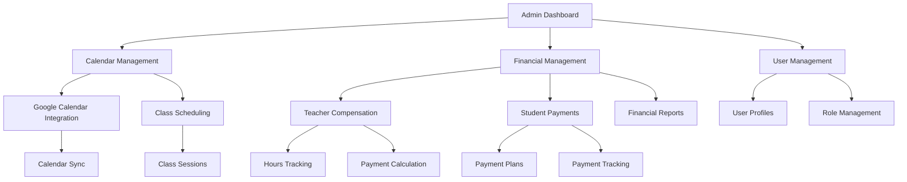
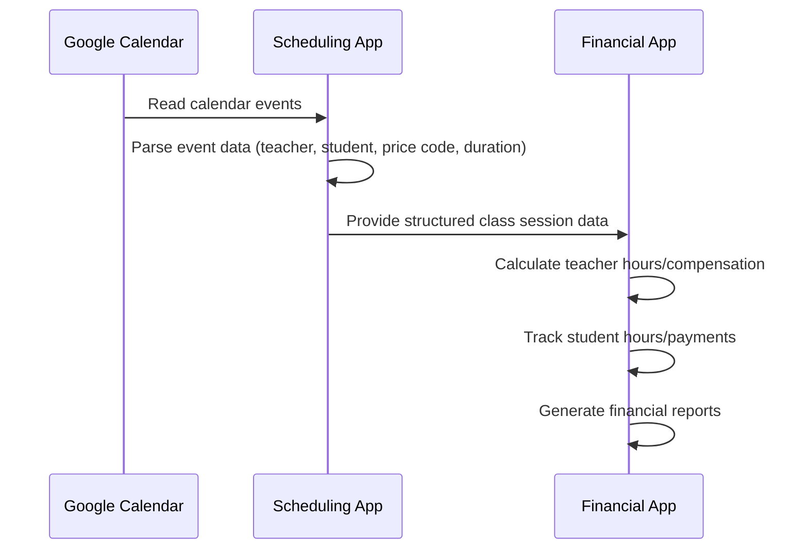

# School Management Platform Specification

## 1. Project Overview

### 1.1 Purpose
A digital platform for specialized training and tutoring centers to manage teachers, students, and parents. The system will streamline administrative tasks, class scheduling, financial tracking, and communication between all stakeholders.

### 1.2 Target Users
- Specialized training/tutoring centers
- Teachers and tutors
- Students (primary school through adult)
- Parents/guardians

### 1.3 Core Problems Addressed
- Centralized management of multiple calendars and schedules
- Automated financial tracking for teachers and students
- Integrated communication and homework management
- Reduction of manual processes and errors

## 2. System Architecture

### 2.1 High-Level Architecture

### 2.2 Financial Data Flow

## 3. Core Features & Requirements

### 3.1 Authentication & Authorization
- JWT-based authentication system
- Passwordless email authentication (email code verification)
- Role-based access control (admin, teacher, student, parent)
- Secure token storage on mobile devices
- Token refresh mechanism for extended sessions

### 3.2 Calendar & Scheduling (READ-ONLY)
- **Read-only** integration with Google Calendar
- No event creation or management within the platform
- Extraction of class data from calendar events:
  - Student name from event title (with "FALTOU" indicating absence)
  - Teacher name from location field
  - Price code from description field
  - Start/end times for duration calculation
- Read-only calendar view for teachers and students to see their schedules

### 3.3 Financial Management (MVP Focus)
- Track teacher hours and calculate compensation
- Track student payments and remaining class hours
- Support multiple payment models:
  - Monthly subscriptions
  - Pay-per-class
  - Package deals
  - Different rates based on class types/subjects

### 3.4 Learning Materials & Homework
- File upload capability
- Assignment creation with due dates
- Teacher feedback functionality

### 3.5 Internationalization
- Multi-language support (initially Portuguese and Spanish)
- Translatable text strings throughout the application

## 4. User Roles & Permissions

### 4.1 Admin Staff (MVP Focus)
- Access to all teacher and student information
- View and manage all calendars
- Financial oversight for the entire system
- User management capabilities
- May also be a teacher with extended permissions

### 4.2 Teachers
- View and manage their own calendar
- Access their list of assigned students
- Post homework/notes to their students
- View their own financial information (earnings)
- Communicate with students

### 4.3 Students
- View their own calendar and scheduled classes
- Access homework assignments
- Submit questions to teachers
- View their own learning materials

### 4.4 Parents
- Extended permissions to access their children's student portals
- View financial information related to their children
- Payment management

## 5. Technology Stack

### 5.1 Backend
- Django framework
  - Django REST Framework for API endpoints
    - ViewSets and Routers for consistent REST API design
    - Serializers for data validation and transformation
    - Nested serialization for related objects
    - Permission classes for access control
    - Filtering, pagination, and search capabilities
    - Proper API documentation
  - JSON Web Token (JWT) authentication
  - Django's built-in admin panel (for direct backend administration)
  - ORM for database interactions
  - Internationalization support

### 5.2 Frontend
- React Native with React Native for Web
  - Single codebase for web, iOS, and Android
  - Component reusability across platforms
  - Proper state management (Context API or Redux)
  - React Navigation patterns for consistent navigation
  - Platform-specific code when necessary
  - Offline support with data synchronization
  - Form handling and validation
  - Responsive design for different screen sizes
- Native UI components for mobile platforms
- Web compatibility via react-native-web

### 5.3 Database
- PostgreSQL or MySQL (compatible with PythonAnywhere)

### 5.4 External Service Integrations
- Google Calendar API for scheduling
- Google Drive API for file storage
- Google Meet or Zoom for virtual sessions
- Push notification services for mobile

## 6. Data Models

### 6.1 User (extends Django's built-in User model)
- Email, first_name, last_name, phone, profile_picture
- Role (admin, teacher, student, parent)
- Google OAuth credentials

### 6.2 Profile Models
- **TeacherProfile**
  - Related to User (one-to-one)
  - Specialties, hourly_rate, bio, qualifications

- **StudentProfile**
  - Related to User (one-to-one)
  - Grade_level, date_of_birth, notes

- **ParentProfile**
  - Related to User (one-to-one)
  - Children (ManyToMany to StudentProfile)

### 6.3 Subject
- Name, description, grade_level_range

### 6.4 ClassType
- Name (e.g., "Apoio ao estudo", "Individual tutoring")
- Group_class (boolean)
- Default_duration (minutes)
- Description

### 6.5 ClassSession (MVP Focus)
- Title, start_time, end_time, status
- Teacher (ForeignKey to User)
- Students (ManyToMany to User)
- Subject (ForeignKey to Subject)
- Class_type (ForeignKey to ClassType)
- Google_calendar_id
- Price_override (optional)

### 6.6 PaymentPlan (MVP Focus)
- Name, description, plan_type (monthly/package)
- Rate (for monthly)
- Hours_included (for package)
- Expiration_period (for package)
- Class_type (ForeignKey to ClassType, optional)

### 6.7 StudentPayment (MVP Focus)
- Student (ForeignKey to User with user_type="student")
- Payment_plan (ForeignKey to PaymentPlan)
- Amount_paid, payment_date
- Period_start, period_end (for monthly)
- Hours_purchased, hours_used (for package)
- Status (pending, completed, cancelled)
- Notes

### 6.8 TeacherCompensation (MVP Focus)
- Teacher (ForeignKey to User with user_type="teacher")
- Period_start, period_end
- Class_sessions (ManyToMany to ClassSession)
- Hours_taught (calculated from sessions)
- Amount_owed (calculated based on ClassType rates)
- Amount_paid
- Payment_date
- Status (pending, completed, cancelled)
- Notes

### 6.9 HomeworkAssignment
- Title, description, due_date
- Teacher (ForeignKey to User)
- Students (ManyToMany to User)
- File_attachments
- Date_created

### 6.10 HomeworkSubmission
- Assignment (ForeignKey to HomeworkAssignment)
- Student (ForeignKey to User)
- Submission_date
- File_attachments
- Feedback, notes

## 7. Security & Compliance

### 7.1 GDPR Compliance
- Privacy policy documentation
- Data processing agreements
- User consent management
- Data export functionality
- Right to be forgotten implementation

### 7.2 Data Protection
- Encryption of sensitive information in the database
- Masked personal information (names, addresses)
- Secure authentication processes
- Regular security audits
- Data backup procedures

## 8. UI/UX Requirements

### 8.1 Design Approach
- Cross-platform design system using React Native components
- Native look and feel on each platform (iOS, Android, Web)
- Focus on functionality and performance
- Intuitive navigation with platform-appropriate patterns

### 8.2 Responsive Design
- Native UI for mobile platforms
- Responsive layouts for web version
- Touch-optimized interactions
- Offline capabilities where possible

### 8.3 User Flows
- Simplified onboarding with platform-specific auth flows
- Native calendar integration on mobile devices
- Touch-optimized financial dashboards
- Native file handling for homework submission

## 9. Deployment

Building philosophy is to use as much of what already exists as possible, focusing on creating a robust API layer with Django and a cross-platform UI with React Native.

### 9.1 Hosting
- Backend: PythonAnywhere or similar cloud hosting
- Web Frontend: Vercel, Netlify, or similar static hosting
- Mobile Apps: Apple App Store and Google Play Store

### 9.2 Environment Setup
- Development, staging, and production environments
- Environment variable management
- CI/CD pipeline for automated testing and deployment
- App store release management

### 9.3 Mobile Considerations
- App store approval processes
- Native performance optimization
- Push notification configuration
- Deep linking support

## 10. Testing Requirements

### 10.1 Unit Testing
- Backend API test coverage with Django REST Framework test tools
- React Native component unit tests with Jest
- API contract validation

### 10.2 End-to-End Testing
- Critical user flows testing across all platforms
- API integration tests
- Authentication flow testing

### 10.3 Platform Compatibility
- iOS testing on multiple device sizes
- Android testing on multiple device sizes
- Cross-browser web testing
- Accessibility compliance testing

## 11. Feature-by-Feature Development Approach

### 11.1 Phase 1: Authentication and User Management
- Passwordless email authentication
- User profiles
- Role-based access control
- Both API endpoints and React Native screens

### 11.2 Phase 2: Financial Management (MVP Focus)
- Payment plans
- Student payment tracking
- Teacher compensation tracking
- Financial dashboards
- Both API endpoints and React Native screens

### 11.3 Phase 3: Calendar & Scheduling
- Google Calendar integration
- Class session management
- Calendar views
- Both API endpoints and React Native screens

### 11.4 Phase 4: Learning Materials & Homework (Post-MVP)
- Homework assignment management
- Homework submission
- File management
- Both API endpoints and React Native screens

## 12. Future Considerations

### 12.1 Features for Later Implementation
- Notification system for classes, homework, and payments
- Reporting dashboards and analytics
- Invoice generation
- Advanced student progress tracking
- Parent-teacher communication portal
- Virtual classroom integration

## Authentication and Permissions

The application implements a comprehensive role-based permission system:

- **Superusers**: Full access to all features and administration
- **Staff**: Access to administrative features but with limited privileges
- **Teachers**: Access to teaching-related features and their own data
- **Students**: Access to learning features and their own data
- **Parents**: Access to their children's data (future)

For specific implementation details, see:
- [User Authentication Flow](/docs/user_authentication.md)
- [Financials Permissions Documentation](/docs/financials_permissions.md)
- [Migration Plan](/docs/migrate_to_react_native_drf.md)
